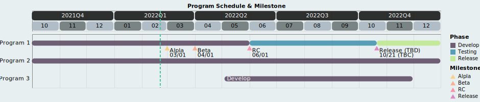

# PrettyGantt

## Description
Simply Python utility to plot pretty Gantt chart for program schedule & milestone from pre-defined JSON, ranges from [-1, +4] quarter based on current date.

## Usage:
1. Define program schedule (Phase_List) and milestone (Event_List) rules in json, including:  
   - Type: Non-repeatable index for phase or event.
   - Description: Unique description for phase & event accordingly.
   - BGColor: Color bar (for phase) or marker (for event) color.
   - FGColor: Font color for bar and marker.

2. Add program to array in JSON.
3. Plot as example.py

## Example:
```bash
python example.py schedule.json
```




## REVISION

1.0.0  
Initial version